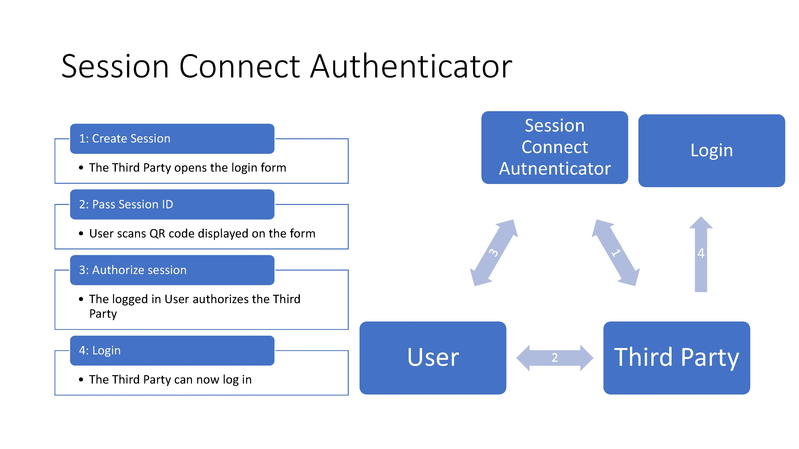

# Session Connect Authenticator

## General
The Session Connect Authenticator for Keycloak enables a way for a third party to log into an user’s account without the user having to provide their login credentials.

This is realized by adding an additional way to login: When the third party tries to log in with the Session Connect Authenticator, a unique ID is generated by the Authenticator and displayed to the third party as a QR code. The user then can scan the QR code and enable this ID on their smartphone, after which the third party can log in with the ID.

## Project Background
This project was created by students of the Technische Universät Darmstadt in collaboration with IBM as part of the Software Engineering Project (http://stg-tud.github.io/sep/).

## Technical Implementation
The Session Connect Authenticator is made out of two parts: the SessionConnectAuthenticator, an implementation of Keycloak’s Authenticator SPI, and the SessionRealmResourceProvider, an implementation of Keycloak’s RealmResourceProvider SPI.

### SessionConnectAuthenticator
The Authenticator checks for the existence of the query parameter “use_sessionconnect” in the URL and skips itself in the Authorisation Flow if the parameter is absent. This is used because Keycloak allows only one Flow per Binding but the Session Connect Authenticator should not appear on every login attempt.
If the parameter is present, the Authenticator generates a UUID as Session ID, stores it temporarily limited in an Infinispan Cache of Keycloak and then sends a Login Form with the generated Session ID back to the party, that wants to log in.
Once the party has continued the login process (by clicking the “Login”-button), the Authenticator checks in the Infinispan Cache if there is an user associated with the provided Session ID and accepts or fails the login attempt according to the result.

### SessionConnectRealmResourceProvider
The SessionConnectRealmResourceProvider is a REST endpoint located at /auth/realms/{realm_name}/sessionconnect/{SessionID} with {SessionID} as path parameter and PUT as verb.
When the endpoint is called, it first checks if the caller is logged in and returns an error if they are not. If the caller is logged in, it then checks if the provided Session IDis found in the Infinispan Cache and puts the user ID of the caller as values to the Session ID in the Cache.

## Deploying the Keycloak Server
There are several ways to add the Session Connect Authenticator to your Keycloak server.

### Deployment on IBM Cloud
Execute deploy.cmd in the Keycloak project. 
Make sure, that the version numbers of the authenticator and the webservice in the beginning of the script are equal to the version numbers defined in the build.gradle files in the corresponding projects. Furthermore, make sure that the version number in deployment.yml is equal to the one defined in deploy.cmd.

### Docker Image
If you want to use a Keycloak server using the Session Connect Authenticator without a Kubernetes cluster on IBM Cloud, you can create and run a Docker image. Make sure, that the version numbers of the Authenticator and the Webservice in the beginning of the script are equal to the version numbers defined in the build.gradle files in the corresponding projects. Then you can build the Authenticator and the Webservice project separately by calling „gradle build“ in the corresponding project directories. Now, you have to create a new directory „module“ in the Keycloak project and copy the .jar files of the builds into this directory, using the names „Authenticator.jar“ and „Webservice.jar“ respectively. After that, copy the ftl directory of the Authenticator into the Keycloak project. If you are using a custom form, replace the .ftl files in this directory with your own. Now you can create a Docker image using the Dockerfile in the Keycloak project.

### Existing Keycloak Server
If you already have an existing Keycloak server, or if you do not want to use Docker, you can add the Session Connect Authenticator as two JBoss modules to your Keycloak server. In order to do that, build the Authenticator and the Webservice separately by calling „gradle build“ in their project directories. For each of the two, create a new JBoss module for each of the resulting .jar files by using the JBoss CLI. Add the modules to the standalone.xml of your JBoss Server. You can find the exact commands in the Dockerfile of this project.

## Configuring the Keycloak Server
1. Open the administration console of your Keycloak server. If you have created the server using the deploy script or the Dockerfile, you can log in with „admin“ as username and password. Of course you should change them to more appropriate values afterwards. 
2. Choose the entry „Authentication“ in the left context menu and copy the existing „Browser“ flow. Alternatively, you can define your own flow.
3. Add the Session Connect Authenticator as a new execution.
4. Mark the Session Connect Authenticator as an alternative. This is necessary, because there has to be another authenticator besides this one, which will be used by the user.
5. Finally move the Session Connect Authenticator up in the priority list, so that it is above all alternativ executions using a form. If you copied the „Browser“ flow, you have to move it above the execution „Copy of Browser Forms“. This is necessary, because in contrast to the Session Connect Authenticator, other form based authenticators cannot be skipped, so they would block the Session Connect Authenticator.
6. A user can now log into the Keycloak server using the following username and password. The URL could look like the following:
http://<keycloak-server>/auth/realms/master/protocol/openid-connect/auth?use_sessionconnect&client_id=...&redirect_uri=...&response_mode=fragment&response_type=code&scope=openid
If a third party wants to log in using the Session Connect Authenticator, he has to add the query parameter „use_sessionconnect“ to the url.

If you want to see some screenshots, take a look into Documentation/Documentation.pdf.

## Using a Custom Form
The form, which will be displayed tot he Third Party can be configured. We recommend to use your own one, specifically tailored to your application's needs. Therfore, you can create your own Freemaker file named "sessionconnect-form.ftl". To use this form, you can replace the file "sessionconnect-form.ftl" in the "ftl" directory of the Authenticator project with your own one. 
The Session Id will be passed to the form under the attribute name "session_id". Make sure the Session Id will be displayed in a format that can be processed by the user's application.
When submitting the form, the Keycloak server needs to know, which Session Id should be used to log in. Therefore, there must be an input element named "session_id" containing the Session Id.
The Third Party has to submit this form, after the user connected the displayed Session Id with his account. If you are displaying the form in a web browser, your form should therefore have a submit element. Alternatively, you can embed the form into your own user interface. In this case, you should submit the form programmatically. If you are doing so, do not forget to add the Session Id as an input parameter to the submission.